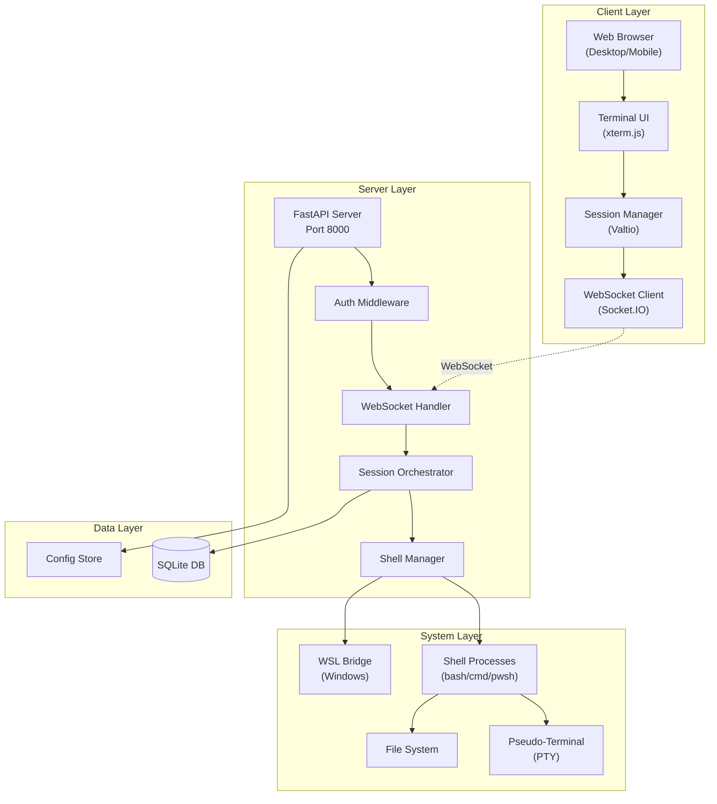
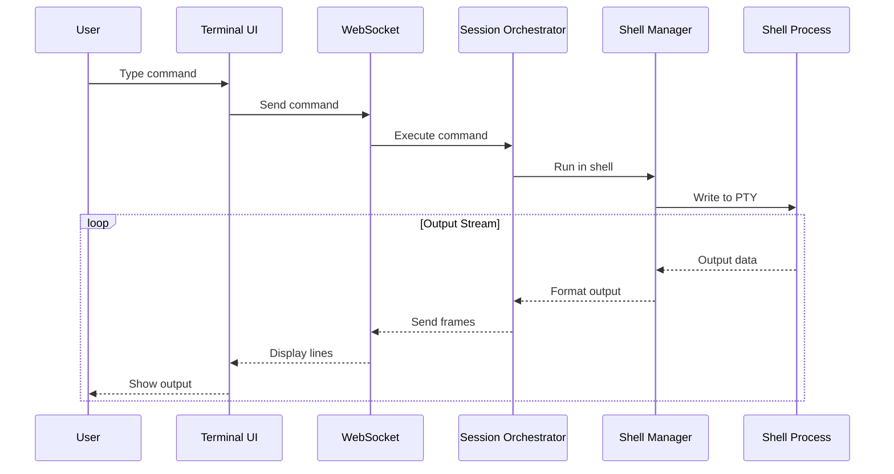

# Remote CLI Interface - Initial Phases Technical Design

## Overview

This design document outlines the technical architecture for the MVP implementation of the Remote CLI Interface. The system provides a web-based terminal interface for remote access to local development machines, focusing on core functionality with a native terminal experience.

## Architecture

### System Architecture



### Component Flow



## Components and Interfaces

### Frontend Components

#### Terminal UI Component
```typescript
interface TerminalUIProps {
  sessionId: string;
  dimensions: { cols: number; rows: number };
  theme: TerminalTheme;
  onCommand: (command: string) => void;
  onResize: (dimensions: Dimensions) => void;
}

class TerminalUI {
  private terminal: Terminal;
  private fitAddon: FitAddon;
  private webLinksAddon: WebLinksAddon;
  
  constructor(container: HTMLElement, props: TerminalUIProps) {
    this.terminal = new Terminal({
      cursorBlink: true,
      fontSize: 14,
      fontFamily: 'Cascadia Code, monospace',
      theme: props.theme,
      scrollback: 10000
    });
  }
  
  writeOutput(data: string): void {
    this.terminal.write(data);
  }
  
  clear(): void {
    this.terminal.clear();
  }
}
```

#### Session Manager
```typescript
interface SessionState {
  sessions: Map<string, Session>;
  activeSessionId: string | null;
  connectionStatus: 'connected' | 'connecting' | 'disconnected';
}

// Valtio proxy-based state
export const sessionStore = proxy<SessionState>({
  sessions: new Map(),
  activeSessionId: null,
  connectionStatus: 'disconnected'
});

export class SessionManager {
  private socket: Socket;
  
  async createSession(config: SessionConfig): Promise<Session> {
    const response = await api.post('/sessions', config);
    const session = response.data;
    
    sessionStore.sessions.set(session.id, session);
    if (!sessionStore.activeSessionId) {
      sessionStore.activeSessionId = session.id;
    }
    
    this.connectWebSocket(session.id);
    return session;
  }
  
  private connectWebSocket(sessionId: string): void {
    this.socket = io('/terminal', {
      query: { sessionId },
      transports: ['websocket'],
      reconnection: true,
      reconnectionDelay: 1000,
      reconnectionDelayMax: 5000
    });
    
    this.socket.on('output', (data: OutputData) => {
      this.handleOutput(sessionId, data);
    });
  }
}
```

#### Mobile Optimizations
```typescript
class MobileTerminalAdapter {
  private hammer: HammerManager;
  private virtualKeyboard: VirtualKeyboard;
  
  constructor(element: HTMLElement) {
    this.hammer = new Hammer(element);
    this.setupGestures();
    this.setupVirtualKeyboard();
  }
  
  private setupGestures(): void {
    // Pinch to zoom
    this.hammer.get('pinch').set({ enable: true });
    this.hammer.on('pinch', (ev) => {
      this.handleZoom(ev.scale);
    });
    
    // Swipe for session switching
    this.hammer.on('swipeleft', () => {
      this.switchToNextSession();
    });
  }
}
```

### Backend Components

#### FastAPI Application Structure
```python
from fastapi import FastAPI, WebSocket
from fastapi.middleware.cors import CORSMiddleware
import socketio

app = FastAPI(title="Remote CLI Interface")
sio = socketio.AsyncServer(async_mode='asgi', cors_allowed_origins=[])
socket_app = socketio.ASGIApp(sio, app)

# Security middleware
app.add_middleware(
    CORSMiddleware,
    allow_origins=["http://localhost:3000"],
    allow_credentials=True,
    allow_methods=["*"],
    allow_headers=["*"]
)

@app.on_event("startup")
async def startup():
    await init_database()
    await load_configuration()
```

#### Session Orchestrator
```python
from typing import Dict, Optional
import asyncio
import uuid

class SessionOrchestrator:
    def __init__(self):
        self.sessions: Dict[str, SessionContext] = {}
        self.shell_manager = ShellManager()
        self.db = SessionDatabase()
    
    async def create_session(
        self,
        name: str,
        shell_type: ShellType,
        working_directory: str = None
    ) -> Session:
        session_id = str(uuid.uuid4())
        
        # Create shell process
        shell_process = await self.shell_manager.create_shell(
            shell_type=shell_type,
            working_directory=working_directory or os.path.expanduser("~")
        )
        
        # Create session context
        session = Session(
            id=session_id,
            name=name,
            shell_type=shell_type,
            working_directory=working_directory,
            process_id=shell_process.pid,
            status=SessionStatus.ACTIVE
        )
        
        context = SessionContext(
            session=session,
            shell_process=shell_process,
            output_queue=asyncio.Queue(),
            command_history=[]
        )
        
        self.sessions[session_id] = context
        
        # Start output reader
        asyncio.create_task(
            self._read_shell_output(session_id)
        )
        
        # Persist to database
        await self.db.save_session(session)
        
        return session
    
    async def execute_command(
        self,
        session_id: str,
        command: str
    ) -> None:
        context = self.sessions.get(session_id)
        if not context:
            raise SessionNotFoundError(session_id)
        
        # Write command to shell
        await context.shell_process.write(command + '\n')
        
        # Record in history
        history_entry = CommandHistory(
            session_id=session_id,
            command=command,
            timestamp=datetime.utcnow()
        )
        context.command_history.append(history_entry)
        await self.db.save_command(history_entry)
```

#### Shell Manager
```python
import asyncio
import sys
from asyncio.subprocess import Process

class ShellManager:
    def __init__(self):
        self.platform = sys.platform
        self.shell_configs = self._load_shell_configs()
    
    async def create_shell(
        self,
        shell_type: ShellType,
        working_directory: str
    ) -> ShellProcess:
        if self.platform == "win32":
            return await self._create_windows_shell(shell_type, working_directory)
        else:
            return await self._create_unix_shell(shell_type, working_directory)
    
    async def _create_unix_shell(
        self,
        shell_type: ShellType,
        working_directory: str
    ) -> ShellProcess:
        import pty
        import os
        import termios
        import struct
        
        # Create pseudo-terminal
        master, slave = pty.openpty()
        
        # Set terminal size
        winsize = struct.pack("HHHH", 24, 80, 0, 0)
        fcntl.ioctl(slave, termios.TIOCSWINSZ, winsize)
        
        # Spawn shell process
        shell_cmd = self._get_shell_command(shell_type)
        process = await asyncio.create_subprocess_exec(
            shell_cmd,
            stdin=slave,
            stdout=slave,
            stderr=slave,
            cwd=working_directory,
            env=self._prepare_environment(shell_type),
            start_new_session=True
        )
        
        os.close(slave)
        
        return ShellProcess(
            process=process,
            master_fd=master,
            shell_type=shell_type
        )
    
    async def _create_windows_shell(
        self,
        shell_type: ShellType,
        working_directory: str
    ) -> ShellProcess:
        # Windows implementation using ConPTY
        if shell_type == ShellType.WSL:
            return await self._create_wsl_shell(working_directory)
        
        # For cmd and PowerShell
        import winpty
        
        pty_process = winpty.PtyProcess.spawn(
            self._get_shell_command(shell_type),
            cwd=working_directory,
            env=self._prepare_environment(shell_type)
        )
        
        return ShellProcess(
            process=pty_process,
            shell_type=shell_type
        )
```

#### WebSocket Handler
```python
@sio.on('connect', namespace='/terminal')
async def handle_connect(sid, environ, auth):
    session_id = auth.get('sessionId')
    if not session_id:
        await sio.disconnect(sid)
        return
    
    # Join session room
    sio.enter_room(sid, f"session:{session_id}")
    
    # Start streaming output
    asyncio.create_task(
        stream_session_output(sid, session_id)
    )

@sio.on('execute_command', namespace='/terminal')
async def handle_execute_command(sid, data):
    session_id = data['sessionId']
    command = data['command']
    
    try:
        await session_orchestrator.execute_command(session_id, command)
    except Exception as e:
        await sio.emit(
            'error',
            {'message': str(e)},
            room=sid,
            namespace='/terminal'
        )

async def stream_session_output(sid: str, session_id: str):
    """Stream output from session to WebSocket client"""
    context = session_orchestrator.sessions.get(session_id)
    if not context:
        return
    
    try:
        while True:
            output = await context.output_queue.get()
            
            # Send to client
            await sio.emit(
                'output',
                {
                    'sessionId': session_id,
                    'data': output.data,
                    'timestamp': output.timestamp.isoformat()
                },
                room=sid,
                namespace='/terminal'
            )
    except asyncio.CancelledError:
        pass
```

### Security Layer

#### Authentication Middleware
```python
from fastapi import HTTPException, Security
from fastapi.security import HTTPBearer, HTTPAuthorizationCredentials
import jwt

class AuthMiddleware:
    def __init__(self, secret_key: str, local_only: bool = True):
        self.secret_key = secret_key
        self.local_only = local_only
        self.security = HTTPBearer()
    
    async def __call__(self, request: Request) -> User:
        # Local-only mode check
        if self.local_only:
            client_host = request.client.host
            if client_host not in ["127.0.0.1", "localhost", "::1"]:
                raise HTTPException(
                    status_code=403,
                    detail="Access denied: Local-only mode enabled"
                )
        
        # Token validation
        credentials: HTTPAuthorizationCredentials = await self.security(request)
        token = credentials.credentials
        
        try:
            payload = jwt.decode(token, self.secret_key, algorithms=["HS256"])
            return User(**payload)
        except jwt.JWTError:
            raise HTTPException(
                status_code=401,
                detail="Invalid authentication credentials"
            )
```

#### Security Filter
```python
import re
from typing import List, Pattern

class SecurityFilter:
    def __init__(self):
        self.sensitive_patterns: List[Pattern] = [
            re.compile(r'password[\s]*[:=][\s]*[\S]+', re.IGNORECASE),
            re.compile(r'(api[_-]?key|apikey)[\s]*[:=][\s]*[\S]+', re.IGNORECASE),
            re.compile(r'(secret|token)[\s]*[:=][\s]*[\S]+', re.IGNORECASE),
            re.compile(r'\b[A-Za-z0-9+/]{40,}={0,2}\b'),  # Base64 secrets
        ]
    
    def filter_output(self, text: str) -> tuple[str, bool]:
        """Filter sensitive data from output"""
        filtered = text
        detected = False
        
        for pattern in self.sensitive_patterns:
            if pattern.search(text):
                detected = True
                filtered = pattern.sub('[FILTERED]', filtered)
        
        return filtered, detected
```

## Data Models

### Database Schema

```sql
-- Sessions table
CREATE TABLE sessions (
    id TEXT PRIMARY KEY,
    name TEXT NOT NULL,
    shell_type TEXT NOT NULL,
    working_directory TEXT NOT NULL,
    status TEXT NOT NULL CHECK(status IN ('active', 'paused', 'terminated')),
    process_id INTEGER,
    created_at TIMESTAMP DEFAULT CURRENT_TIMESTAMP,
    last_activity TIMESTAMP,
    ai_enhancement_enabled BOOLEAN DEFAULT FALSE,
    output_line_count INTEGER DEFAULT 0,
    
    INDEX idx_sessions_status (status),
    INDEX idx_sessions_last_activity (last_activity)
);

-- Command history table
CREATE TABLE command_history (
    id TEXT PRIMARY KEY,
    session_id TEXT NOT NULL,
    sequence INTEGER NOT NULL,
    command TEXT NOT NULL,
    exit_code INTEGER,
    execution_time_ms INTEGER,
    timestamp TIMESTAMP DEFAULT CURRENT_TIMESTAMP,
    contains_sensitive_data BOOLEAN DEFAULT FALSE,
    
    FOREIGN KEY (session_id) REFERENCES sessions(id) ON DELETE CASCADE,
    UNIQUE(session_id, sequence),
    INDEX idx_command_history_session (session_id, timestamp DESC)
);

-- Output storage (batched for performance)
CREATE TABLE output_batches (
    id TEXT PRIMARY KEY,
    session_id TEXT NOT NULL,
    command_id TEXT,
    batch_sequence INTEGER NOT NULL,
    line_count INTEGER NOT NULL,
    compressed_data BLOB,
    created_at TIMESTAMP DEFAULT CURRENT_TIMESTAMP,
    
    FOREIGN KEY (session_id) REFERENCES sessions(id) ON DELETE CASCADE,
    FOREIGN KEY (command_id) REFERENCES command_history(id),
    INDEX idx_output_batches_session (session_id, batch_sequence)
);

-- User preferences
CREATE TABLE user_preferences (
    user_id TEXT PRIMARY KEY,
    default_shell TEXT,
    theme TEXT DEFAULT 'dark',
    font_size INTEGER DEFAULT 14,
    scrollback_lines INTEGER DEFAULT 10000,
    ai_enhancement_default BOOLEAN DEFAULT FALSE,
    updated_at TIMESTAMP DEFAULT CURRENT_TIMESTAMP
);
```

### Data Access Layer

```python
from sqlalchemy.ext.asyncio import AsyncSession, create_async_engine
from sqlalchemy.orm import sessionmaker

class SessionDatabase:
    def __init__(self, database_url: str = "sqlite+aiosqlite:///./remote_cli.db"):
        self.engine = create_async_engine(database_url)
        self.async_session = sessionmaker(
            self.engine,
            class_=AsyncSession,
            expire_on_commit=False
        )
    
    async def save_session(self, session: Session) -> None:
        async with self.async_session() as db:
            db_session = SessionModel(
                id=session.id,
                name=session.name,
                shell_type=session.shell_type.value,
                working_directory=session.working_directory,
                status=session.status.value,
                process_id=session.process_id
            )
            db.add(db_session)
            await db.commit()
    
    async def get_active_sessions(self) -> List[Session]:
        async with self.async_session() as db:
            result = await db.execute(
                select(SessionModel)
                .where(SessionModel.status == 'active')
                .order_by(SessionModel.last_activity.desc())
            )
            return [self._model_to_session(s) for s in result.scalars()]
```

## Error Handling

### Error Types and Handling

```python
class RemoteCLIError(Exception):
    """Base exception for all Remote CLI errors"""
    def __init__(self, message: str, code: str, details: dict = None):
        self.message = message
        self.code = code
        self.details = details or {}
        super().__init__(message)

class SessionError(RemoteCLIError):
    """Session-related errors"""
    pass

class ShellError(RemoteCLIError):
    """Shell process errors"""
    pass

# Global error handler
@app.exception_handler(RemoteCLIError)
async def handle_remote_cli_error(request: Request, exc: RemoteCLIError):
    return JSONResponse(
        status_code=400,
        content={
            "error": {
                "code": exc.code,
                "message": exc.message,
                "details": exc.details,
                "timestamp": datetime.utcnow().isoformat(),
                "request_id": request.state.request_id
            }
        }
    )
```

### Recovery Strategies

```python
class SessionRecovery:
    async def recover_session(self, session_id: str) -> bool:
        """Attempt to recover a failed session"""
        try:
            # Get session from database
            session = await self.db.get_session(session_id)
            if not session:
                return False
            
            # Check if process still exists
            if self._is_process_alive(session.process_id):
                # Reattach to existing process
                return await self._reattach_process(session)
            else:
                # Create new process with same config
                return await self._restart_session(session)
        except Exception as e:
            logger.error(f"Session recovery failed: {e}")
            return False
```

## Testing Strategy

### Unit Test Example

```python
import pytest
from unittest.mock import AsyncMock, MagicMock

@pytest.mark.asyncio
async def test_create_session():
    # Arrange
    orchestrator = SessionOrchestrator()
    orchestrator.shell_manager.create_shell = AsyncMock(
        return_value=MagicMock(pid=12345)
    )
    
    # Act
    session = await orchestrator.create_session(
        name="Test Session",
        shell_type=ShellType.BASH,
        working_directory="/tmp"
    )
    
    # Assert
    assert session.id is not None
    assert session.name == "Test Session"
    assert session.status == SessionStatus.ACTIVE
    assert session.process_id == 12345
```

### Integration Test Example

```python
@pytest.mark.asyncio
async def test_websocket_command_execution():
    async with AsyncClient(app=app, base_url="http://test") as client:
        # Create session
        response = await client.post("/sessions", json={
            "name": "Test",
            "shellType": "bash"
        })
        session = response.json()
        
        # Connect WebSocket
        async with client.websocket_connect(
            f"/terminal?sessionId={session['id']}"
        ) as websocket:
            # Send command
            await websocket.send_json({
                "type": "execute_command",
                "data": {"command": "echo 'Hello World'"}
            })
            
            # Receive output
            message = await websocket.receive_json()
            assert message["type"] == "output"
            assert "Hello World" in message["data"]["content"]
```

### Performance Test Example

```python
import asyncio
import time

async def test_concurrent_sessions_performance():
    start_time = time.time()
    
    # Create 100 concurrent sessions
    tasks = [
        create_and_execute_session(f"Session {i}")
        for i in range(100)
    ]
    
    results = await asyncio.gather(*tasks)
    
    elapsed = time.time() - start_time
    
    # Assert performance targets
    assert elapsed < 10  # Should complete in under 10 seconds
    assert all(r["success"] for r in results)
    assert all(r["latency"] < 100 for r in results)  # Sub-100ms latency
```

## Configuration

### Environment Variables

```python
from pydantic import BaseSettings

class Settings(BaseSettings):
    # Server configuration
    host: str = "127.0.0.1"
    port: int = 8000
    
    # Security
    local_only_mode: bool = True
    secret_key: str = "your-secret-key-here"
    jwt_algorithm: str = "HS256"
    
    # Database
    database_url: str = "sqlite+aiosqlite:///./remote_cli.db"
    
    # Shell defaults
    default_shell: str = "bash" if sys.platform != "win32" else "cmd"
    shell_timeout: int = 300  # 5 minutes
    
    # Performance
    max_concurrent_sessions: int = 100
    output_buffer_size: int = 1000000  # 1MB
    
    # WebSocket
    websocket_ping_interval: int = 25
    websocket_ping_timeout: int = 60
    
    class Config:
        env_file = ".env"
        env_prefix = "REMOTE_CLI_"

settings = Settings()
```

### Configuration File

```yaml
# config.yaml
server:
  host: "127.0.0.1"
  port: 8000
  workers: 4

security:
  local_only: true
  allowed_origins:
    - "http://localhost:3000"
    - "http://127.0.0.1:3000"

shells:
  available:
    - type: "bash"
      path: "/bin/bash"
      env:
        TERM: "xterm-256color"
    - type: "powershell"
      path: "pwsh"
      args: ["-NoProfile"]

performance:
  max_output_buffer: 1048576  # 1MB
  command_timeout: 300  # 5 minutes
  idle_timeout: 3600  # 1 hour
```

## Deployment

### Docker Configuration

```dockerfile
# Dockerfile
FROM python:3.11-slim

WORKDIR /app

# Install system dependencies
RUN apt-get update && apt-get install -y \
    build-essential \
    && rm -rf /var/lib/apt/lists/*

# Install Python dependencies
COPY requirements.txt .
RUN pip install --no-cache-dir -r requirements.txt

# Copy application code
COPY . .

# Create non-root user
RUN useradd -m -u 1000 appuser && chown -R appuser:appuser /app
USER appuser

# Run application
CMD ["uvicorn", "main:app", "--host", "0.0.0.0", "--port", "8000"]
```

### Docker Compose

```yaml
version: '3.8'

services:
  api:
    build: ./apps/api
    ports:
      - "8000:8000"
    environment:
      - REMOTE_CLI_LOCAL_ONLY_MODE=true
      - REMOTE_CLI_DATABASE_URL=sqlite+aiosqlite:///./data/remote_cli.db
    volumes:
      - ./data:/app/data
      - /var/run/docker.sock:/var/run/docker.sock:ro  # For Docker access
    restart: unless-stopped
  
  web:
    build: ./apps/web
    ports:
      - "3000:3000"
    depends_on:
      - api
    environment:
      - NEXT_PUBLIC_API_URL=http://localhost:8000
    restart: unless-stopped
```

## Architecture Summary

This design provides a solid foundation for the Remote CLI Interface MVP with:

1. **Real-time Communication**: WebSocket-based architecture with Socket.IO for reliability
2. **Multi-Session Support**: Concurrent session management with process isolation
3. **Cross-Platform Compatibility**: Unified shell abstraction supporting Windows, Linux, and WSL
4. **Security First**: Local-only mode, authentication, and sensitive data filtering
5. **Performance Optimized**: Sub-100ms latency with efficient state management
6. **Mobile Ready**: Touch gestures and responsive design
7. **Extensible Design**: Clear component boundaries for future enhancements

The architecture supports the phased development approach, allowing the core terminal functionality to be built first, with AI enhancements and plugin systems added in later phases.